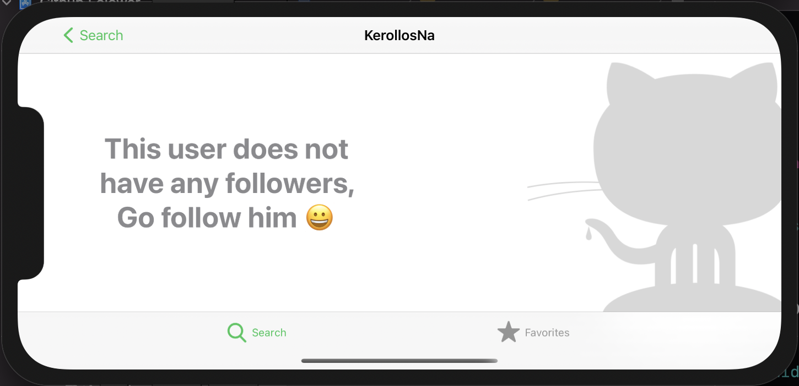
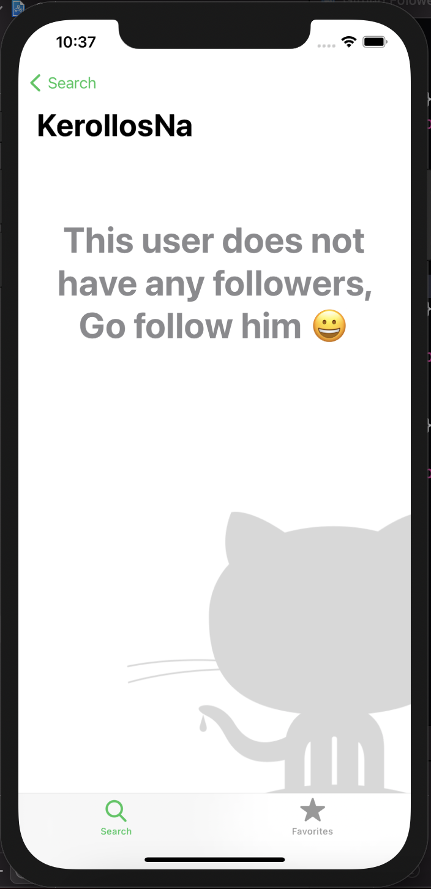
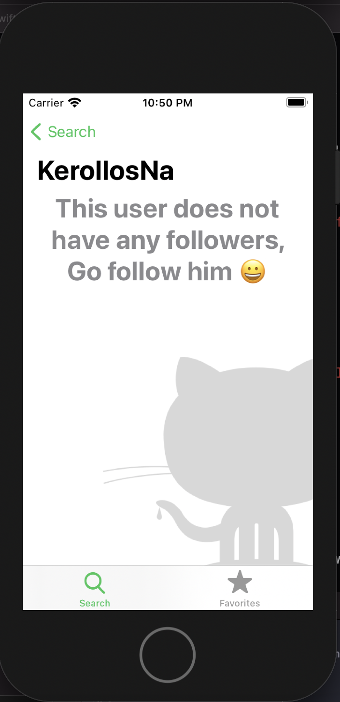
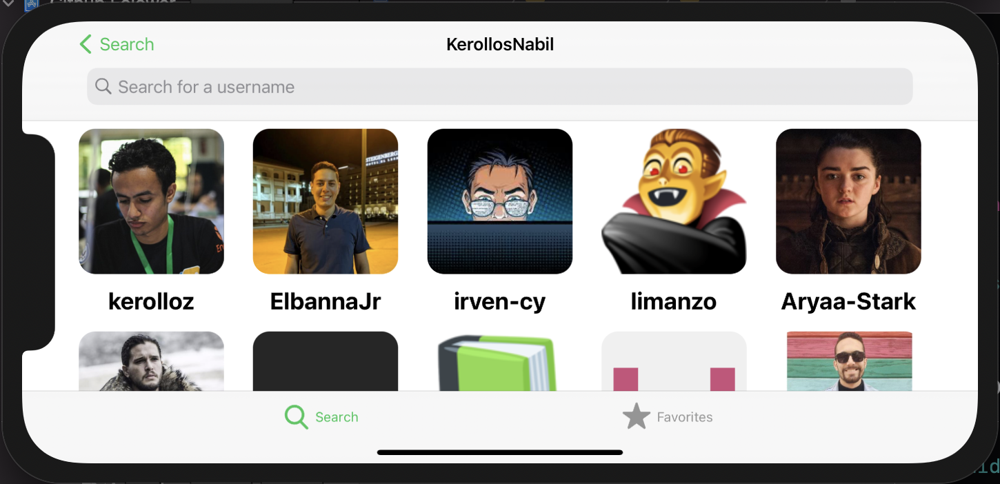
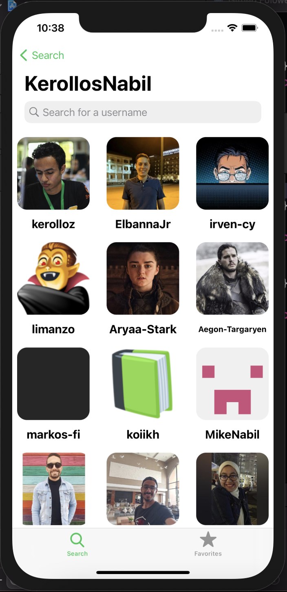
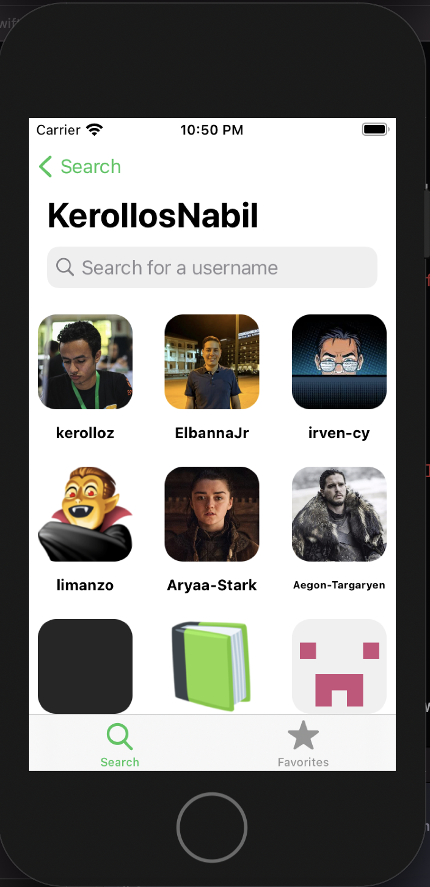
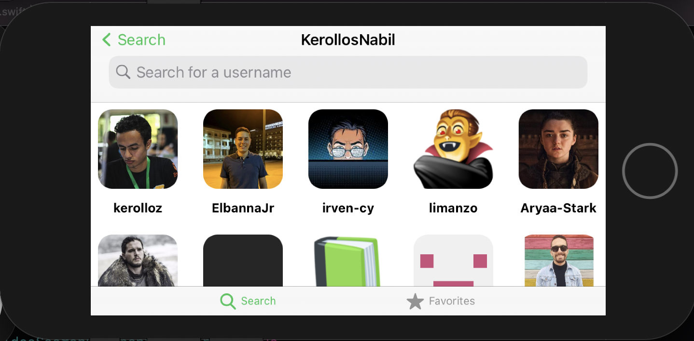

# Github Folower (from Sellen course)

## discreption

this app asks you for a GitHub username and gives you back a list of your GitHub followers and you can see everyone's public information and handling all the error cases with a good looking customized alert and empty view and will food in landscape and portrait mode and will look identical in every device

## my art on the app

* create <ins>**AutoLayoutHelper**</ins> framework that is used to make a <ins>**hardcoded**</ins> the constraints for autolayout and it will look <ins>**identical**</ins> in all the devices and it handles the <ins>**rotation**</ins> and the <ins>**size classes**</ins> for you  

```swift
layoutHelper.attatchScaledToWidth(anchor: itemViewOne.topAnchor, to: headerInfoView.bottomAnchor, constant: padding, for: [.CompactRegular, .RegularRegularPortrait,.RegularRegularLandscape], designOrientationIsPortrait: true)
        layoutHelper.attatchScaledToWidth(anchor: itemViewOne.leadingAnchor, to: view.leadingAnchor, constant: padding, for: [.CompactRegular, .RegularRegularPortrait,.RegularRegularLandscape], designOrientationIsPortrait: true)
        layoutHelper.attatchScaledToWidth(anchor: itemViewOne.trailingAnchor, to: view.safeAreaLayoutGuide.trailingAnchor, constant: -padding, for: [.CompactRegular, .RegularRegularPortrait,.RegularRegularLandscape], designOrientationIsPortrait: true)
        layoutHelper.addScaledToWidth(dimension: itemViewOne.heightAnchor, equalconstant: 145, for: [.CompactRegular, .RegularRegularPortrait,.RegularRegularLandscape], designOrientationIsPortrait: true)
        
        // landscape
        
        layoutHelper.attatchScaledToHeight(anchor: itemViewOne.bottomAnchor, to: view.centerYAnchor, constant: -padding/2, for: [.CompactCompact, .RegularCompact], designOrientationIsPortrait: false)
        layoutHelper.attatchScaledToHeight(anchor: itemViewOne.leadingAnchor, to: view.centerXAnchor, constant: padding, for: [.CompactCompact, .RegularCompact], designOrientationIsPortrait: false)
        layoutHelper.attatchScaledToHeight(anchor: itemViewOne.trailingAnchor, to: view.safeAreaLayoutGuide.trailingAnchor, constant: -padding, for: [.CompactCompact, .RegularCompact], designOrientationIsPortrait: false)
        layoutHelper.addScaledToHeight(dimension: itemViewOne.heightAnchor, equalconstant: 140, for: [.CompactCompact, .RegularCompact], designOrientationIsPortrait: false)
```

new ratio in landscape                  |  new ratio in portrait    |  old ratio in portrait    |  old ratio in landscape
:------------------------------:|:---------------------------------:|:------------------------------:|:---------------------------------:
 |    |  | 
 |    |  | 
 |    |  | 
 |    |  | 