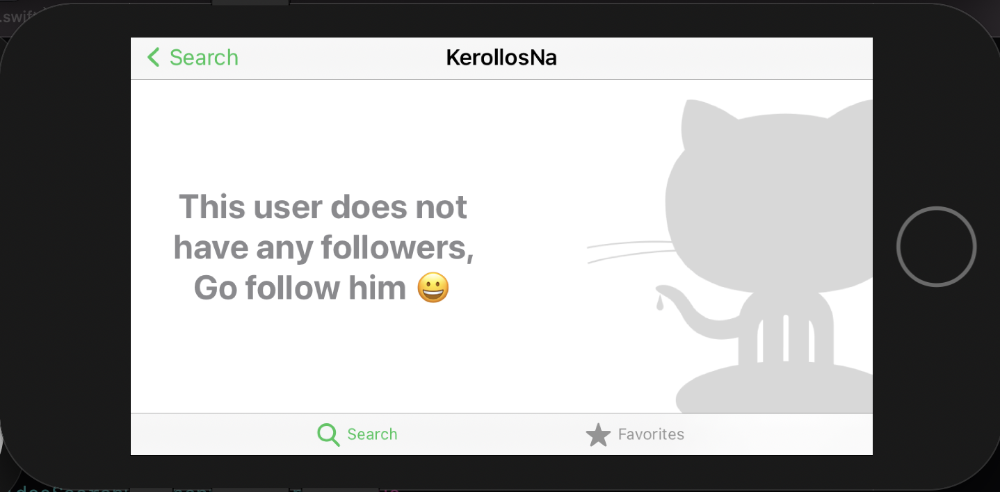
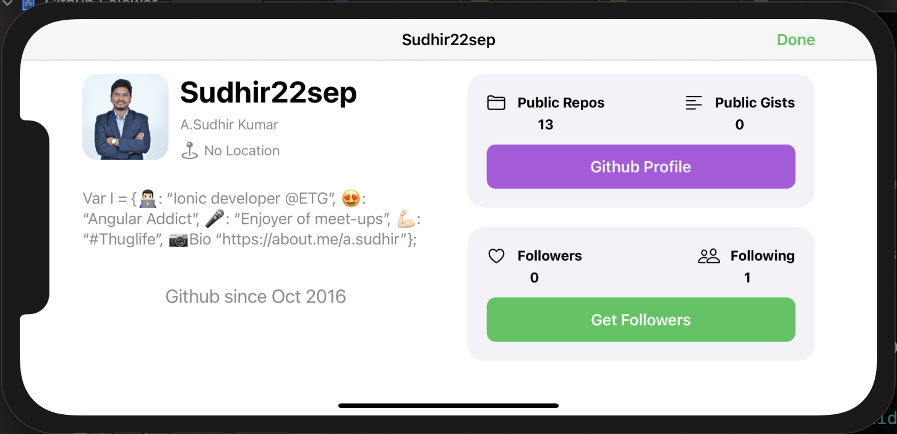
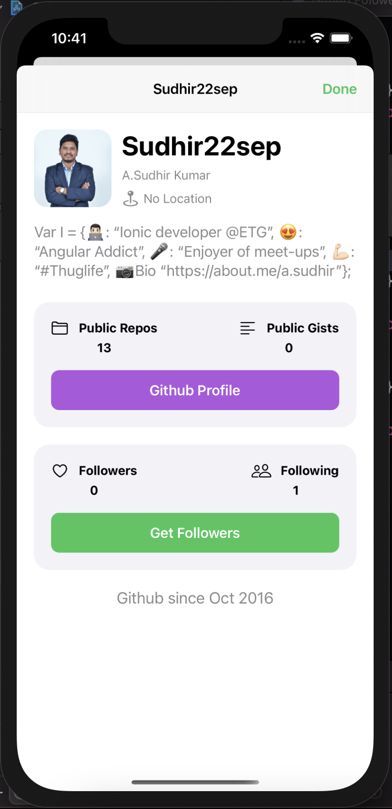
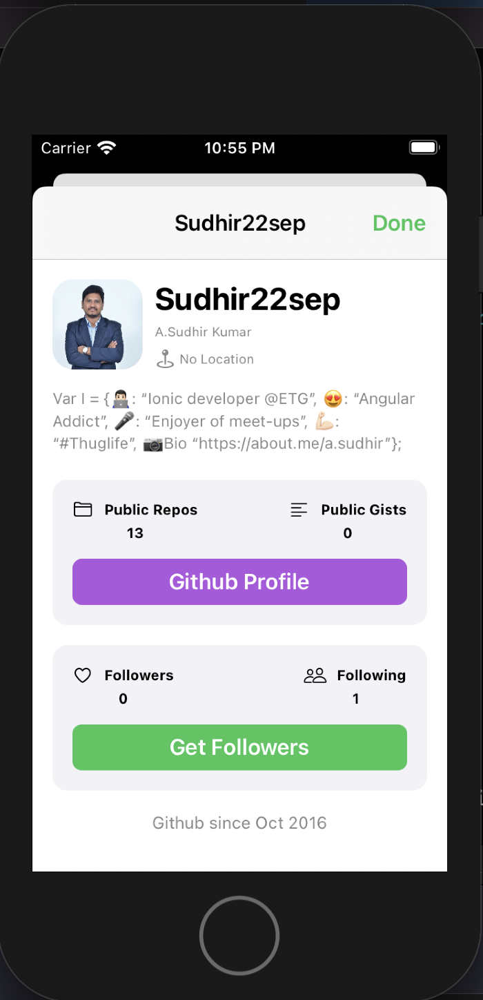
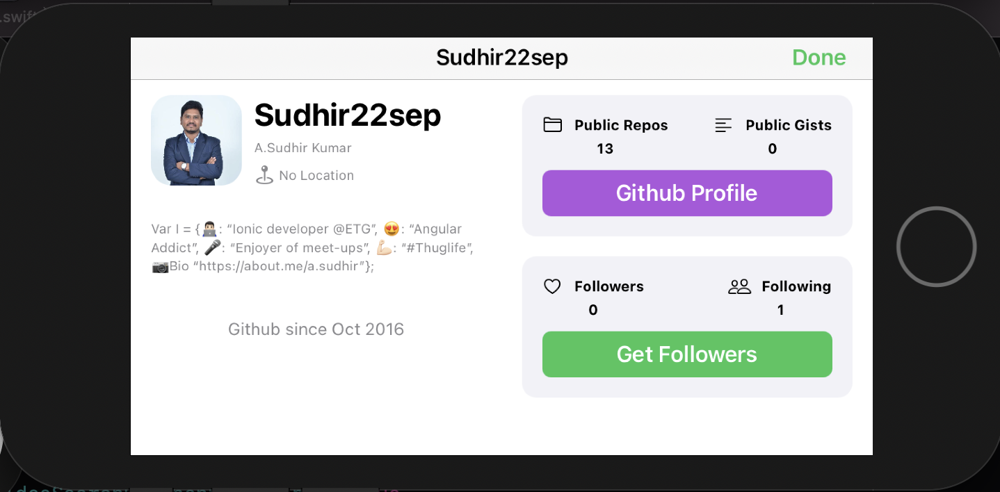

# Github Folower (from Sellen course)

## discreption

this app asks you for a GitHub username and gives you back a list of your GitHub followers and you can see everyone's public information and handling all the error cases with a good looking customized alert and empty view and will food in landscape and portrait mode and will look identical in every device

## my art on the app

* create <ins>**AutoLayoutHelper**</ins> framework that is used to make a <ins>**hardcoded**</ins> the constraints for autolayout and it will look <ins>**identical**</ins> in all the devices and it handles the <ins>**rotation**</ins> and the <ins>**size classes**</ins> for you  

new ratio in landscape                  |  new ratio in portrait    |  old ratio in portrait    |  old ratio in landscape
:------------------------------:|:---------------------------------:|:------------------------------:|:---------------------------------:
 |    |  | 
 |    |  | 
 |    |  | 
 |    |  | 